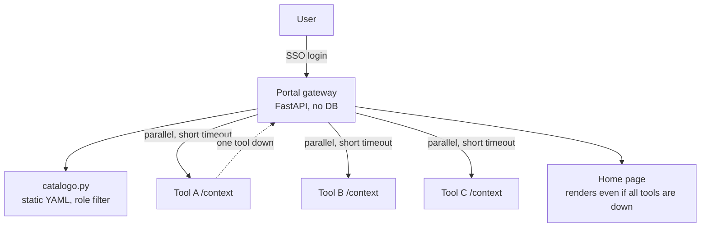

# Modular Platform Portal

> The gateway in front of a set of independent internal tools: one login, one catalog of what
> you have access to, one "resume where you left off" strip across all of them — with none of
> the tools' own availability depending on this gateway being healthy.

<p align="center">
  
  
  
</p>

> This is an anonymized, backend-only extract from a larger internal platform I built at an
> engineering company. **No UI code is included** — `frontend/index.html` here is a placeholder
> stub, not the real design. Company-specific references have been removed; the gateway logic,
> SSO integration, and resilience design are real.

## Problem → Solution → Result

**Problem.** A handful of independent internal tools (each its own app, its own database, its
own login) need one shared entry point: sign in once, see only the tools you're allowed to use,
and get a quick "what was I doing" view across all of them — without turning that shared entry
point into a single point of failure, and without it needing to know anything about what happens
*inside* any tool.

**Solution.** A thin FastAPI gateway with **no database of its own**. It reads a static,
generated catalog of tools and the role each requires, authenticates via SSO, and asks each
tool's own API — over the internal network, in parallel, with a short timeout — for two small,
optional signals: "what was this user last doing here" and "is this user active right now." If a
tool doesn't answer, is slow, or errors out, the portal just shows that tool's card without the
extra context — it never lets one tool's failure affect the others or the home page itself.

**Result.** The home page (`GET /`) never calls out to anything — it renders instantly even if
every downstream tool is down. Access control doesn't move to the gateway either: seeing a
tool's card is not the same as being allowed in — each tool enforces its own authorization
independently, so "the portal already filtered it" can never become an excuse to relax a tool's
own checks.

---

## Architecture



### Key design decisions

| Decision | Why |
|---|---|
| **No database in the gateway** | It only knows what's in the static catalog and what it asked a tool just now — nothing to keep in sync, nothing to migrate |
| **Catalog visibility ≠ access control** | `catalogo.py` decides which cards are *shown*; every tool still enforces its own login/role check independently — if that line gets blurred, a tool could end up trusting the gateway's filtering instead of checking for itself |
| **Each cross-tool signal degrades independently** | "Resume where you left off" and "who's active now" are two unrelated optional features; one tool failing to answer either never blocks the home page or the other feature |
| **Activity signal can't come from the SSO provider** | The identity provider's own session timeout (30 min of inactivity) doesn't match each tool's much longer session cookie (8 h) — reading "active" from the IdP would show someone as gone while they're still mid-task; each tool reports its own activity because only it actually knows |
| **Pure logic separated from the one function that touches the network** | `catalogo.py` and the validation half of `contexto.py` have no I/O at all, so they're fully unit-testable without a running server; only one explicit function per module performs the actual HTTP call |

---

## Stack

Python 3.11+ · FastAPI · httpx (async, parallel calls to each tool) · OIDC/Keycloak SSO ·
server-side sessions (signed cookie, no server-side session store)

## Running it

```bash
uv sync  # or pip install -e .
cp .env.example .env     # SSO issuer/client, SECRET_KEY
uv run uvicorn backend.app:app --reload
```

`herramientas.yaml` is the generated catalog: one entry per registered tool (id, display name,
description, icon, URL, required role). It's generated from each tool's own manifest, not
hand-edited — a consistency test fails the build if they drift apart.

## Project structure

```
modular-platform-portal/
├── backend/
│   ├── app.py            # FastAPI app, SSO session, route wiring
│   ├── catalogo.py        # Pure logic: load + role-filter the tool catalog
│   ├── contexto.py        # "Resume where you left off" — validation (pure) + fetch (I/O)
│   ├── conectados.py      # "Who's active now" — same split, independent feature
│   └── sso.py             # OIDC/Keycloak login flow
├── herramientas.yaml      # Generated tool catalog
├── frontend/               # Placeholder only — real UI not included
└── tests/
```

## Limitations & next steps

- The catalog format assumes every tool exposes the same small optional contract
  (`/context`, "active now"); a tool that can't implement it just shows up without that extra
  information, by design.
- No rate limiting on the fan-out calls to tools yet — fine at the current tool count, would
  need a cap before scaling to many more.

## License

MIT — see [LICENSE](LICENSE). Anonymized, backend-only portfolio extract; not the original
production repository.
